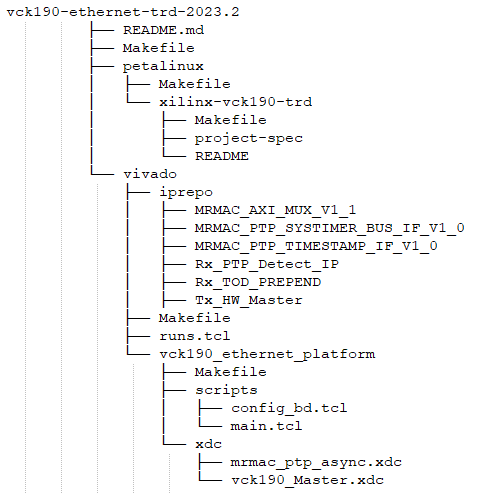

<table class="sphinxhide">
 <tr>
   <td align="center"><h1> Versal Prime-VCK190 Evaluation Kit Tutorial</h1>
   </td>
 </tr>
 <tr>
 <td align="center"><h1>Using Vivado to Build the Hardware Design</h1>

 </td>
 </tr>
</table>

TRD Package
================================================

Accessing the Tutorial Reference Files
---------------------------------------

<!--- >**Note**: Skip the following steps if the design files have already been cloned and extracted to a working repository --->

1. Download the 2023.2 Source Files from <a href="https://github.com/Xilinx/vck190-ethernet-trd">TRD Home Page </a> .

2. Unzip the TRD package.

3. Navigate to the `../vck190-ethernet-trd-2023.2` which is the working directory.

TRD package File Structure:
----------------------------
* The TRD package file hierarchy is shown in the below snapshot.



The TRD package contains: 

1. `Makefile` has scripts to build the entire TRD package hardware and software platforms in a single run.  

2. `README.md` README.md contains the documentation. 

3. `vivado` folder contains files to create the vck190 ethernet hardware platform. 	

4. `petalinux` folder contains files to build the petalinux images. 

Build Flow
================================================
 
This tutorial shows how to build the TRD package.

### Prerequisites

* Vivado Design Suite 2023.2
* PetaLinux 2023.2 tools

To Build the TRD Package with the top Makefile:
-----------------------------------------------

Running the `../vck190-ethernet-trd-2023.2/Makefile` will generate the hardware platform XSA and subsequently the petalinux images.

1. Go to the working directory

   ```
   cd vck190-ethernet-trd-2023.2
   ```
   
2. Run the following command to build and generate sdcard image. This Makefile calls lower level Makefiles to build hardware XSA and petalinux images. The XSA generation may take couple of hours depending on the system specification.

   ```
   make sdcard
   ```
To Build the Hardware Platform XSA:
-------------------------------------------
This tutorial shows how to build XSA alone using the makefiles

* Generate XSA using `../vck190-ethernet-trd-2023.2/vivado/Makefile`


1. Go to the platform directory specific to the application

   ```
   cd vck190-ethernet-trd-2023.2/vivado/
   ```
   
2. To build the XSA, Source Vivado and run the following command. The Makefile uses scripts/main.tcl file to create a Vivado project, populate the block design and finally build a XSA. The XSA generation may take couple of hours depending on the system specification

   ```
   make design_xsa   
   ```

3.	The generated XSA will be located at:

   ```
   $working_dir/vivado/vck190_ethernet_platform/project/mrmac_subsys_wrapper.xsa
   ```
* Generate XSA from top make file `../vck190-ethernet-trd-2023.2/Makefile`:


1. Navigate to the `vck190-ethernet-trd` which is the working directory
 
  ```
   make vivado_design design=<Platform name> JOBS=<n>
   
   ```

## Modifying the design and creating a new XSA

>**Note**: The steps below are optional and are required only if you need to change the platform design. 

1. Go to the directory specific to the platform design

   ```
   cd $working_dir/vivado/vck190_ethernet_platform/
   ```

2. To open the Vivado project, first open the Vivado GUI, then run the following command from the Vivado tcl console:

   ```
   open_project ./project/mrmac_subsys.xpr
   ```

3. In the Flow Navigator pane on the left-hand side under IP integrator, click on Open Block Design. An IP integrator block design becomes visible that contains the Processing System (PS) IP and other PL IPs.

4. In the Flow Navigator pane on the left-hand side under Program and Debug, click on Generate Device Image. The device image (pdi) for the design will be generated and available at `$working_dir/vivado/<platform_name>/projec/impl_1/mrmac_subsys_wrapper.pdi`.

5. To generate the XSA, select File → Export→ Export Hardware.

	The Export Hardware dialog box opens.

		Choose Include device image and click Next.

		Provide the name for the exported file as mrmac_subsys_wrapper and use the default location to save the file. Click Next.

		A warning message appears if a Hardware Module has already been exported. Click Yes to overwrite the existing XSA file, if the overwrite message is displayed.

		Click Finish.

To Build the Petalinux Images:
-------------------------------
In the following sections, the steps to build petalinux images are given.

Follow the steps below to build petalinux images using the Makefile in `../vck190-ethernet-trd-2023.2/petalinux/xilinx-vck190-trd path`

1. Go to the petalinux BSP folder.

   ```
   cd ../vck190-ethernet-trd-2023.2/petalinux/xilinx-vck190-trd
   
   ```
2. To build boot images, source petalinux tool and run the following command. 
   
   The Makefile configures the hardware platform required to build the petalinux images and create BOOT.BIN, which comprise of  FSBL, UBoot, PMU firmware and hardware bit file.

   ```
   make boot
  
   ```
3. The generated images will be located at:

   ```
   ../vck190-ethernet-trd-2023.2/petalinux/xilinx-vck190-trd/images/linux
   
   ```
4. Copy the image (`BOOT.BIN , rootfs.cpio.gz.uboot , Image and boot.scr` ) to the FAT32 formatted SD card and insert the card in SD card slot to run the design. This image is functionally equivalent to the prebuilt sdcard image provided with package.

### Next Steps

* [Setting up the Board and Application Deployment](platform/docs/app_deployment.md)
* Go back to the [VCK190 Targeted Reference Designs start page](platform/docs/introduction.md)

### References

For more information on how to setup Platform Interfaces refer to Xilinx Vitis Unified Software Platform Documentation [UG1393](https://www.xilinx.com/support/documentation/sw_manuals/xilinx2020_2/ug1393-vitis-application-acceleration.pdf)
* Petalinux user guide [UG1144](https://www.xilinx.com/support/documentation/sw_manuals/xilinx2020_2/ug1144-petalinux-tools-reference-guide.pdf)
## License

Licensed under the Apache License, Version 2.0 (the "License"); you may not use this file except in compliance with the License.

You may obtain a copy of the License at
[http://www.apache.org/licenses/LICENSE-2.0](http://www.apache.org/licenses/LICENSE-2.0)


Unless required by applicable law or agreed to in writing, software distributed under the License is distributed on an "AS IS" BASIS, WITHOUT WARRANTIES OR CONDITIONS OF ANY KIND, either express or implied. See the License for the specific language governing permissions and limitations under the License.

<p align="center">Copyright © 2023 Advanced Micro Devices, Inc</p>
