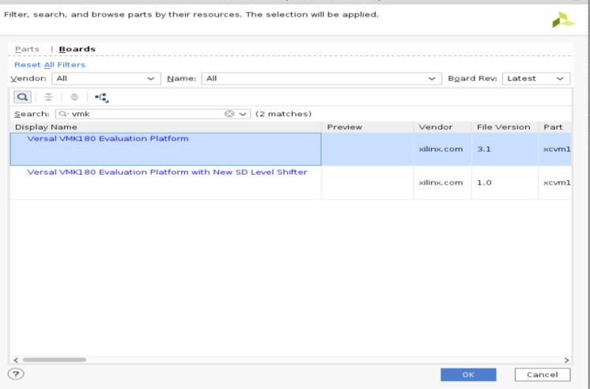

<table class="sphinxhide">
 <tr>
   <td align="center"><h1> Versal Prime - VCK190 Evaluation Kit Ethernet TRD Tutorial</h1>
   </td>
 </tr>
 <tr>
 <td align="center"><h1>Build the TRD Package for VMK180 Board</h1>

 </td>
 </tr>
</table>


Steps to Build the TRD Package for VMK180 Board
=========================================================

Prerequisites
--------------
* Vivado Design Suite 202x.x
* PetaLinux 202x.x tools

Accessing the Tutorial Reference Files
--------------------------------------
1. Download the TRD package from <a href="https://github.com/Xilinx/vck190-ethernet-trd">TRD Home Page </a>.

2. Unzip the TRD package.

3. Navigate to the `../vck190-ethernet-trd-202x.x>` which is the working directory.

Build the hardware Design
-------------------------

1. Go to the platform directory `../vck190-ethernet-trd-202x.x/vivado`.


2. Source the 202x.x Vivado Tool.

3. Run the Makefile to build the hardware design for the vck190 Evaluation Board.
  
   ```
    make design_xsa   
   
   ```
   
   > * **Note:Do not run the Synthesis and Implementation steps. This can be achieved by commenting **source ../runs.tcl** command in `../vck190_ethernet_platform/scripts/main.tcl`**


4. Open Vivado Tool in GUI Mode.

5. Open Project   `../vck190-ethernet-trd-202x.x/vivado/vck190_ethernet_platform/project/mrmac_subsys.xpr`

6. Open the settings in Project Manager pane, and in Project Settings General tab click **Project device** to change the Board part.

7. In the Boards tab, search for **vmk180** and select the Versal VMK180 Evaluation Platform (xcvm1802-vsva2197-2MP-e-S) as shown below.

	


8. After selection, the project settings looks like below for the VMK180 Evaluation Board.

	


9. Click **OK** to proceed. A popup will shows up as below, click **No** to proceed further.

	

10. Open Report Tab and click **Report IP Status**

11. The list of IPs to be upgraded will be listed down, click **Upgrade Selected** to upgrade the IPs.

11. Save and Validate the Block design.

12. In the Project Manager pane on the left-hand side under Program and Debug, click on **Generate Device Image**. The device image (pdi) for the design will be generated and available at `$working_dir/vivado/<platform_name>/projec/impl_1/mrmac_subsys_wrapper.pdi`.

13. To generate the XSA, select File → Export→ Export Hardware. While generating XSA make sure to Include device Image.


Build the petalinux Image
--------------------------
1. Go to the petalinux directory `../vck190-ethernet-trd/petalinux/xilinx-vck190-trd/`

2. Source the 202x.x petalinux tool.

3. The project needs to be configured with the XSA file for **VMK180** 

    ```
	 petalinux-config --get-hw-description=<path of xsa> --silentconfig

    ```
4. Run the below commands to build and package the wic image in compressed format:

    ```
     petalinux-build
     petalinux-package --boot --psm no --plm no --add images/linux/Image --load 0x00200000 --add images/linux/rootfs.cpio.gz.u-boot --load 0x04000000 --add images/linux/boot.scr --load 0x20000000 --force --uboot
     petalinux-package --wic --wic-extra-args "-c xz"
    ```

    The generated compressed image file will be located at `images/linux/petalinux-sdimage.wic.xz`.

5. To uncompress wic file use following command
   ```
    xz -d -v images/linux/petalinux-sdimage.wic.xz
   ```
6. Follow the steps mentioned in [Setting up the Board and Application Deployment](./app_deployment.md) to run the application.


### Next Steps
* Go back to the [VCK190 Ethernet TRD design start page](../platform_landing.md)

## License

Licensed under the Apache License, Version 2.0 (the "License"); you may not use this file except in compliance with the License.

You may obtain a copy of the License at
[http://www.apache.org/licenses/LICENSE-2.0](http://www.apache.org/licenses/LICENSE-2.0)

Unless required by applicable law or agreed to in writing, software distributed under the License is distributed on an "AS IS" BASIS, WITHOUT WARRANTIES OR CONDITIONS OF ANY KIND, either express or implied. See the License for the specific language governing permissions and limitations under the License.

<p align="center">Copyright&copy; 2022 Xilinx</p>
