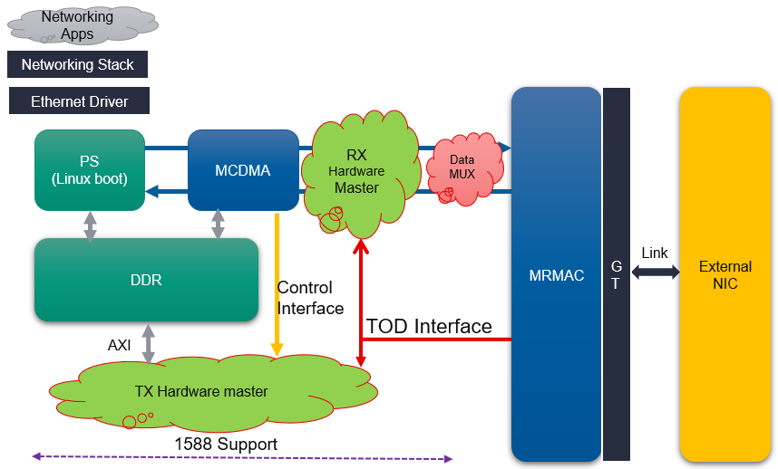
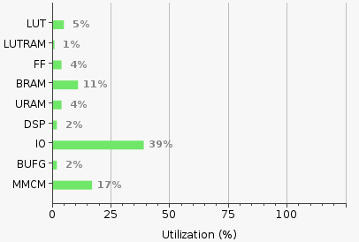

<table class="sphinxhide">
 <tr>
   <td align="center"><h1> Versal Prime -VCK190 Evaluation Kit   Ethernet TRD Tutorial</h1>
   </td>
 </tr>
 <tr>
 <td align="center"><h1> Hardware Architecture of the Platform </h1>

 </td>
 </tr>
</table>

Hardware Architecture of the Platform
=====================================

Introduction
---------------
 This section describes the design implemented on Control Interface and Processor System (CIPS) and Programmable Logic (PL) on the VCK190 board.

 The following figure shows the top level hardware architecture of the reference design. The following section provides the details of various components in the platform as illustrated in the figure:

* Control Interface and Processor Subsystem (CIPS):
The CIPS present in Versal devices contains high performance ARM A72 processors. On-chip and cache memory are included along with a suite of hardened communication peripherals. In the initial platform, an ARM A72 device will be employed and will be given access to 2GBytes of DDR RAM.

* Programmable Logic (PL)
This contains the following main IP:

  * Network-On-Chip (NoC) 
    Versal devices are designed around a NoC interconnect, which provides high bandwidth communication between different areas of the device. In this Platform NoC will be used     to: 
    * Transmit the streaming ethernet data received by the AXI MCDMA to the memory. 
    * Transmit the ethernet data from the memory to the MRMAC via the streaming interface of the AXI MCDMA.

  * Multi Rate Media Access Control (MRMAC) 
  
    The MRMAC IP has AXI stream ports at the transmit and receive ends. The ethernet packets are transmitted/received via these AXI streaming ports. It has an AXI-Lite	             interface for accessing the control information of the IP.

  * Quad Base Gigabit Transceiver Interface (GTY) 
  
    The Quad Base GT receives ethernet data from the external world and transmits it to the MRMAC IP. It also takes the Ethernet data from MRMAC and transmits it to the outside     world.

  * AXI Direct Memory Access (AXI-MCDMA) 
  
    This is a standard AXI Multi Channel Direct Memory Access IP used in the PL. This facilitates the transfer of the Ethernet packets to       the MRMAC for MAC processing.

  * Tx PTP HW Master on the Transmission path to detect PTP packet and store timestamp in memory.

  * Rx HW Master logic to detect PTP packet and prepend the PTP Timestamp with corresponding Ethernet data. 

The following is the packet flow for the normal Ethernet packets in both direction:

* Transmit:

  o The Ethernet data generated and stored in the memory.

  o This data is transferred to the MRMAC via AXI MCDMA MM2S interface.

  o The MRMAC, after processing the packets transmits it to the GTY.

  o The GTY Transmits this data to the output onto the Ethernet link.

  o The GTY output is connected to an external NIC. This NIC receives the ethernet packets.

* Receive:

  o The External NIC generated Ethernet packets.
	
  o This data is received at the GT interface.
	
  o From the GT, the data is transferred to MRMAC.
	
  o The MRMAC sends this data via the streaming interface to the S2MM port of AXI MCDMA.
	
  o The AXI MCDMA writes this data onto the memory.
  
For the PTP Packets, the PL based PTP Packet processors are used in both Transmit and Receive directions.

In the Transmit direction, the PTP Packet processor is present between AXI MCDMA MM2S and MRMAC Tx interfaces.

In the Receive direction, the PTP Packet processor is present between MRMAC Rx and AXI MCDMA S2MM interfaces.

Further details on the PTP Packet processors can be found in this page. [Hardware Architecture of the PTP Packet Processor](hw_arch_ptp_pkt_proc.md)

Resource Utilization
--------------------------

 

**Next Steps**

* [Hardware Architecture of the PTP Packet Processor](hw_arch_ptp_pkt_proc.md)
* Go back to the [VCK190 Ethernet TRD design start page](../platform_landing.md)

**License**

Licensed under the Apache License, Version 2.0 (the "License"); you may not use this file except in compliance with the License.

You may obtain a copy of the License at
[http://www.apache.org/licenses/LICENSE-2.0](http://www.apache.org/licenses/LICENSE-2.0)

Unless required by applicable law or agreed to in writing, software distributed under the License is distributed on an "AS IS" BASIS, WITHOUT WARRANTIES OR CONDITIONS OF ANY KIND, either express or implied. See the License for the specific language governing permissions and limitations under the License.

Copyright&copy; 2021 Xilinx

