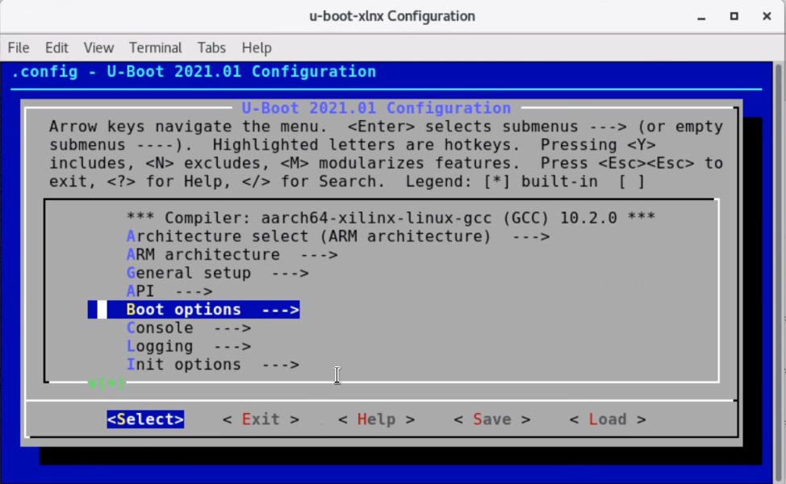

<table class="sphinxhide">
 <tr>
   <td align="center"><h1>Versal Prime -VCK190 Evaluation Kit  Ethernet TRD Tutorial</h1>
   </td>
 </tr>
 <tr>
 <td align="center"><h1>Known Issues and Limitations</h1>

 </td>
 </tr>
</table>

Known Issues
============

* TRD boot delay

The on board IDT clock acts as a source for the GT reference clock. The Board UI programs the IDT clock via I2C bus.
If customer uses "Set Boot Frequency" clock option from BoardUI, system-controller running on ZynqMP and MRMAC/PTP drivers running on Versal 
are trying to access the I2C bus at the same time. Due to contention Versal MRMAC/PTP driver fails to register.

Solution: As a workaround to solve above mentioned issue, increased boot_delay in u-boot to 15sec, which increases the overall TRD application boot time.

If customer does not use "Set Boot Frequency" option from BoardUI, to reduce boot-delay back to default value, please follow below steps:

    1. Run below command to get u-boot options 
    petalinux-config -c u-boot

    2. Select "Boot options" as shown in figure below

    3. Select "Autoboot options" as shown in figure below

    4. Change delay from 15sec to default value(5 sec's), as shown in figure below

* The Timer/Syncer IP is provided as a packaged local user repo IP because it is meant to be used only with Ethernet IPs based reference designs

* PTP application may give time out error when CPU load is high. By default, PTP application waits for Tx timestamp.
If timestamp is not obtained within the specified wait time then PTP application gives timeout error.

* TRD supports 2-step operation only

* Enhanced PTP logic supports only L2 and UDP IPv4 PTP packets

* When running iperf, the user is expected to see a slightly lower throughput on the port on which dhcp server or other broadcast apps are running.

**License**

Licensed under the Apache License, Version 2.0 (the "License"); you may not use this file except in compliance with the License.

You may obtain a copy of the License at
[http://www.apache.org/licenses/LICENSE-2.0](http://www.apache.org/licenses/LICENSE-2.0)

Unless required by applicable law or agreed to in writing, software distributed under the License is distributed on an "AS IS" BASIS, WITHOUT WARRANTIES OR CONDITIONS OF ANY KIND, either express or implied. See the License for the specific language governing permissions and limitations under the License.

Copyright&copy; 2021 Xilinx

