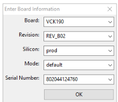
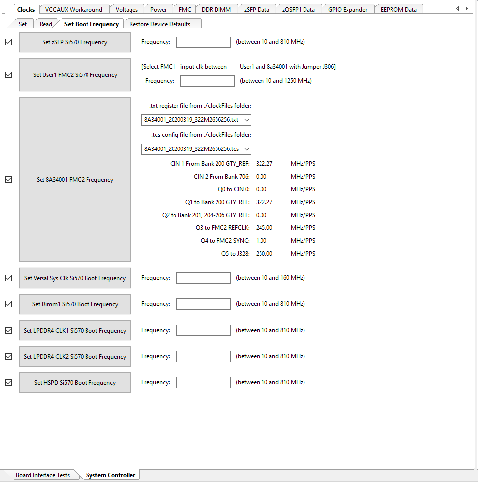
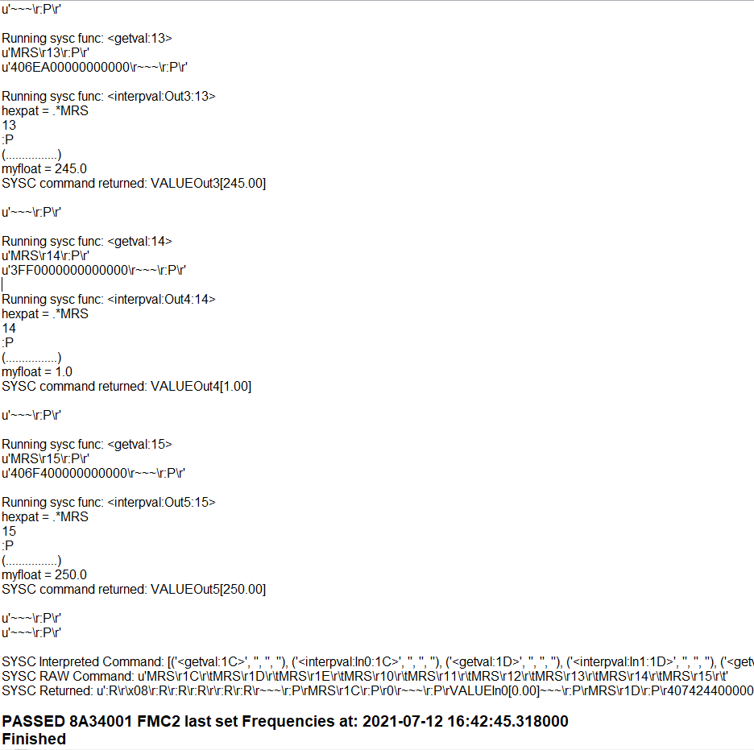

<table class="sphinxhide">
 <tr>
   <td align="center"><h1> Versal Prime - VCK190 Evaluation Kit Ethernet TRD Tutorial</h1>
   </td>
 </tr>
 <tr>
 <td align="center"><h1> Board Setup and Application Deployment</h1>

 </td>
 </tr>
</table>

Setting up the Board and Application Deployment
=================================================

Introduction
----------------
This document shows how to set up the board and run the Ethernet TRD application.

###  Prerequisites

 * Reference design zip file

 * Terminal emulator, for example:

      Windows: teraterm (https://osdn.net/projects/ttssh2)

      Linux: picocom (https://github.com/npat-efault/picocom/releases)

      Disk Imager utility, for example
      
      Windows/linux: Balena Etcher [Balena Etcher](https://sourceforge.net/projects/win32diskimager)

 * Host Machine with 4 x 10G NIC 
  
     Install iperf3

### Flash the SD Card
 * Download  the `vck190_ethernet_trd_prebuilt_2021.1.zip` package, unzip and save it on your computer. Alternatively, go through the tutorials section to build `petalinux-sdimage.wic` locally.
  
  * cd into the directory containing the compressed wic file
  
    To uncompress wic file use following command: 
    
	```
	cd vck190_ethernet_trd_prebuilt_2021.1
	
	xz -d -v petalinux-sdimage.wic.xz
	```

	This generates a output file named:
	`petalinux-sdimage.wic`.
  
  * Connect the microSD to your computer.

  * Download the [Balena Etcher tool](https://www.balena.io/etcher/) (recommended; available for Window, Linux, and 
  macOS) required to flash the SD card.

  * Follow the instructions in the tool and select the downloaded image to flash onto your microSD card. 

    

  * Eject the SD card from your computer.

    For other OS specific tools to write the image to the SD card refer to [Setting up the SD Card Image](https://www.xilinx.com/products/som/kria/kv260-vision-starter-kit/kv260-getting-started/setting-up-the-sd-card-image.html)

### SD card partitions

Once the raw image is written to the SD card, you will be able to see two partitions. In the first partition (FAT32 format) resides:

      * Boot image (BOOT.BIN)

      * u-boot boot script (boot.scr)

      * Linux kernel image (Image)

The second patition (ext4 format) contains the root file system.

> * Note: Windows OS will only allow the FAT32 boot partition to be viewed, and the ext4 rootfs partition will not be recognized.

### Board Setup
The following figure shows how to set up the VCK190 evaluation board.


  **Board jumper and switch settings**

This is a one-time setup and the board should have been delivered to you with this default setting, however it is good to double check for the first time when you get the board.

* Make sure you remove J326 (7-8) jumper.

* Setup SYSCTRL Boot mode switch SW11 to (ON,OFF,OFF,OFF) from switch bits 1 to 4 as shown in the above picture.

* Make sure you have the SYSCTRL uSD card inserted in the slot and card has the SYSCTRL image.

* Setup Versal Boot Mode switch SW1 to (ON,OFF,OFF,OFF) from switch bits 1 to 4 as shown in the above picture.

 **External NIC to VCK190 connection**
 
Connect a QSFP-28 cable from external NIC on a host machine to VCK190 QSFP port as shown in the above snapshot

 **Serial console settings**

VCK190 comes with a USB-C connector for JTAG+UART, when connected three UART ports should be visible in Device Manager:

* Versal UART0

* Versal UART1 &

* System Controller UART

Connect a USB-C cable to the USB-UART connector. In a terminal emulator, connect to Versal UART0 using the following settings:

* Baud Rate: 115200

* Data: 8 bit

* Parity: None

* Stop: 1 bit

* Flow Control: Non

### Versal VCK190 Setup
 
 **Setting the GT reference clock using Board UI:**

> * Note: The following board settings need to be performed before booting Linux images on VCK190 in all boot modes using latest tools.
	Latest Board UI and System controller images information can be obtained [here](https://xilinx-wiki.atlassian.net/wiki/spaces/A/pages/973078551/BEAM+Tool+for+VCK190+Evaluation+Kit)

       * Open the VCK190 Board UI application. Choose the board information as shown in the below figure.
       
  

  
       * Once the GUI is open, go to File -> Change the System Controller Port. Choose the port corresponding to the system controller. 
	     On the bottom left, click on System Controller Tab.
   

       * Go to Set Boot Frequency Tab. Choose the .txt and .tcs files as shown below.
   
     
       * Click on Set 8A34001 FMC2 Frequency. Once the clocks are set, user will see the following in the logs window.
   
    
     This will program the GT Reference clocks needed for the design.

 ### SD Boot mode steps:
 
  1. Place the boot image on to the SD and power on the board in SD boot mode.


### Run Host and VCK190 applications

Once the host and VCK190 are booted, set up an IP address for each ethernet port and make sure the Ethernet link is established using ping. Do not proceed until you are able to ping each interface.

 * Execute the following command on the Host 

   > iperf3 -s -i 60

 * Execute the following command on Target(EP) to start traffic

   > iperf3 -c <remote Host IP> -t 60 -i 60
 
 * PTP commands:
 
 Use as 2-step PTP server:
   
     VCK190> ptp4l -i <interface name> -m
     
     Link partner> ptp4l -i <interface name> -m -s

 Use as 2-step PTP client:
    
    Link partner> ptp4l -i <interface name> -m
 
    VCK190> ptp4l -i <interface name> -m -s

 Use as 1-step PTP server:
 
	End-to-End (E2E) Protocol
    
    VCK190> ptp4l -i <interface name> -m -f /usr/bin/default_onestep.cfg
	
	Link Partner> ptp4l -i <interface name> -m -s -E
	
 Use as 1-step PTP client:
 
	End-to-End (E2E) Protocol
    
    Link Partner> ptp4l -i <interface name> -m -E
	
	VCK190> ptp4l -i <interface name> -m -s -f /usr/bin/default_onestep.cfg
	
 Use as 1-step PTP server:
 
	Peer-to-Peer (P2P) Protocol
    	
	VCK190> ptp4l -i <interface name> -m -f /usr/bin/default_onestepp2p.cfg
	
 Use as 1-step PTP client:
 
	Peer-to-Peer (P2P) Protocol
    	
	VCK190> ptp4l -i <interface name> -m -s -f /usr/bin/default_onestepp2p.cfg
	
	
### Dynamic switching between 10G <-> 25G

By default the image links up at 25G.

	Note: a) For dynamic switching between 10G/25G speed, make sure autonegotiation is ON for the particular interface on the NIC

	example command to switch ON autonegotiation: ethtool -s <interface name> speed <10000/25000> autoneg on
	
	b) After switching, please expect a delay (~2s) for MRMAC block lock to complete and Link to be detected. 
	
	c) If the block lock does not happen- immediately, try making the interface down and up to achieve block lock.

To switch between 10G and 25G speeds dynamically use the following commands:

 10G -> 25G:
 
	ifconfig <interface name> down
	
	ethtool -s <interface name> speed 25000
	
	ifconfig <interface name> up
	
 25G -> 10G
 
	ifconfig <interface name> down
	
	ethtool -s <interface name> speed 10000
	
	ifconfig <interface name> up


### Next Steps
* Go back to the [VCK190 Ethernet TRD design start page](../platform_landing.md)

## License

Licensed under the Apache License, Version 2.0 (the "License"); you may not use this file except in compliance with the License.

You may obtain a copy of the License at
[http://www.apache.org/licenses/LICENSE-2.0](http://www.apache.org/licenses/LICENSE-2.0)

Unless required by applicable law or agreed to in writing, software distributed under the License is distributed on an "AS IS" BASIS, WITHOUT WARRANTIES OR CONDITIONS OF ANY KIND, either express or implied. See the License for the specific language governing permissions and limitations under the License.

<p align="center">Copyright&copy; 2021 Xilinx</p>
